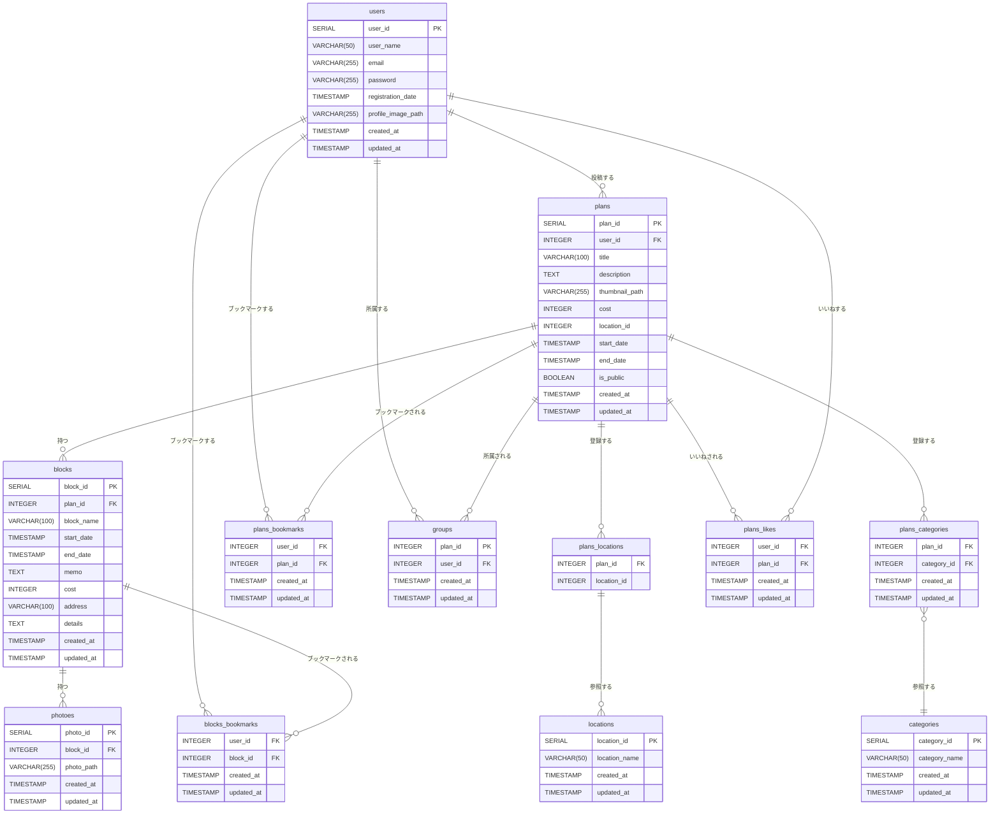

# manetabi_api

## リレーション

---

```mermaid
erDiagram
    users ||--o{ plans: "投稿する"
    plans ||--o{ blocks: "持つ"
    blocks ||--o{ photoes: "持つ"
    plans ||--o{ plans_locations: "登録する"
		plans_locations||--o{ locations: "参照する"
		users ||--o{ plans_bookmarks: "ブックマークする"
		users ||--o{ blocks_bookmarks: "ブックマークする"
		plans ||--o{ plans_bookmarks: "ブックマークされる"
    users ||--o{ groups: "所属する"
		plans_categories }o--|| categories: "参照する"
		plans ||--o{ groups : "所属される"
		plans ||--o{ plans_categories: "登録する"
		plans ||--o{ plans_likes: "いいねされる"
		users ||--o{ plans_likes: "いいねする"
		blocks ||--o{ blocks_bookmarks: "ブックマークされる"


    users {
        SERIAL user_id PK
        VARCHAR(50) user_name
        VARCHAR(255) email
        VARCHAR(255) password
        TIMESTAMP registration_date
		VARCHAR(255) profile_image_path
        TIMESTAMP created_at
        TIMESTAMP updated_at
    }
    plans {
        SERIAL plan_id PK
        INTEGER user_id FK
        VARCHAR(100) title
        TEXT description
        VARCHAR(255) thumbnail_path
        INTEGER cost
        INTEGER location_id
        TIMESTAMP start_date
        TIMESTAMP end_date
        BOOLEAN is_public
        TIMESTAMP created_at
        TIMESTAMP updated_at
    }
    blocks {
        SERIAL block_id PK
        INTEGER plan_id FK
        VARCHAR(100) block_name
        TIMESTAMP start_date
        TIMESTAMP end_date
        TEXT memo
        INTEGER cost
        VARCHAR(100) address
        TEXT details
        TIMESTAMP created_at
        TIMESTAMP updated_at
    }
    photoes {
        SERIAL photo_id PK
        INTEGER block_id FK
        VARCHAR(255) photo_path
        TIMESTAMP created_at
        TIMESTAMP updated_at
    }
    locations {
        SERIAL location_id PK
        VARCHAR(50) location_name
        TIMESTAMP created_at
        TIMESTAMP updated_at
    }
    categories {
        SERIAL category_id PK
        VARCHAR(50) category_name
        TIMESTAMP created_at
        TIMESTAMP updated_at
    }
    plans_bookmarks {
        INTEGER user_id FK
        INTEGER plan_id FK
        TIMESTAMP created_at
        TIMESTAMP updated_at
    }
    blocks_bookmarks {
        INTEGER user_id FK
        INTEGER block_id FK
        TIMESTAMP created_at
        TIMESTAMP updated_at
    }
    plans_likes {
        INTEGER user_id FK
        INTEGER plan_id FK
        TIMESTAMP created_at
        TIMESTAMP updated_at
    }
    plans_locations {
        INTEGER plan_id FK
        INTEGER location_id
    }
    plans_categories {
        INTEGER plan_id FK
        INTEGER category_id FK
        TIMESTAMP created_at
        TIMESTAMP updated_at
    }
    groups {
        INTEGER plan_id PK
        INTEGER user_id FK
        TIMESTAMP created_at
        TIMESTAMP updated_at
    }

```
