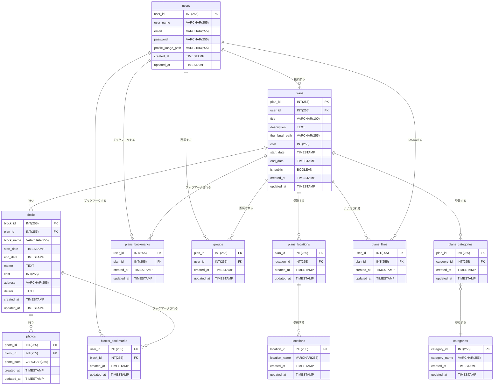

# リレーション

---

# データ設計

---

## **user**

| カラム名           | 説明                     | 型           | Key         | AUTOINCREMENT | Unique | Nullable |
| ------------------ | ------------------------ | ------------ | ----------- | ------------- | ------ | -------- |
| user_id            | ユーザ ID                | INT(255)     | PRIMARY KEY | YES           |        | NO       |
| user_name          | ユーザー名               | VARCHAR(255) |             |               |        | NO       |
| email              | メールアドレス           | VARCHAR(255) |             |               | YES    | NO       |
| password           | ハッシュ化したパスワード | VARCHAR(255) |             |               |        | NO       |
| profile_image_path | プロフィール画像パス     | VARCHAR(255) |             |               |        | YES      |
| created_at         | 作成した時間             | TIMESTAMP    |             |               |        | NO       |
| updated_at         | 更新した時間             | TIMESTAMP    |             |               |        | NO       |

## **plans**

| カラム名       | 説明               | 型           | Default | Key         | AUTOINCREMENT | Nullable |
| -------------- | ------------------ | ------------ | ------- | ----------- | ------------- | -------- |
| plan_id        | プラン ID          | INT(255)     |         | PRIMARY KEY | YES           | NO       |
| user_id        | ユーザ ID          | INT(255)     |         | FOREIGN KEY |               | NO       |
| title          | タイトル           | VARCHAR(100) |         |             |               | NO       |
| description    | 説明文             | TEXT         |         |             |               | YES      |
| thumbnail_path | サムネイル画像パス | VARCHAR(255) |         |             |               | YES      |
| cost           | 費用               | INT(255)     |         |             |               | YES      |
| start_date     | 開始日時           | TIMESTAMP    |         |             |               | YES      |
| end_date       | 終了日時           | TIMESTAMP    |         |             |               | YES      |
| is_public      | 公開フラグ         | BOOLEAN      | FALSE   |             |               | NO       |
| created_at     | 作成した時間       | TIMESTAMP    |         |             |               | NO       |
| updated_at     | 更新した時間       | TIMESTAMP    |         |             |               | NO       |

## **blocks**

| カラム名   | 説明         | 型           | Key         | AUTOINCREMENT | Nullable |
| ---------- | ------------ | ------------ | ----------- | ------------- | -------- |
| block_id   | ブロック ID  | INT(255)     | PRIMARY KEY | YES           | NO       |
| plan_id    | プラン ID    | INT(255)     | FOREIGN KEY |               | NO       |
| block_name | ブロック名   | VARCHAR(255) |             |               | NO       |
| start_date | 開始日時     | TIMESTAMP    |             |               | NO       |
| end_date   | 終了日時     | TIMESTAMP    |             |               | NO       |
| memo       | メモ         | TEXT         |             |               | YES      |
| cost       | 費用         | INT          |             |               | YES      |
| address    | 住所         | VARCHAR(255) |             |               | YES      |
| details    | 詳細         | TEXT         |             |               | YES      |
| created_at | 作成した時間 | TIMESTAMP    |             |               | NO       |
| updated_at | 更新した時間 | TIMESTAMP    |             |               | NO       |

## **photos**

| カラム名   | 説明         | 型           | Key         | AUTOINCREMENT | Nullable |
| ---------- | ------------ | ------------ | ----------- | ------------- | -------- |
| photo_id   | 画像 ID      | INT(255)     | PRIMARY KEY | YES           | NO       |
| block_id   | ブロック ID  | INT(255)     | FOREIGN KEY |               | NO       |
| photo_path | 画像パス     | VARCHAR(255) |             |               | NO       |
| created_at | 作成した時間 | TIMESTAMP    |             |               | NO       |
| updated_at | 更新した時間 | TIMESTAMP    |             |               | NO       |

## **locations**

| カラム名      | 説明         | 型           | Key         | AUTOINCREMENT | Unique | Nullable |
| ------------- | ------------ | ------------ | ----------- | ------------- | ------ | -------- |
| location_id   | 場所 ID      | INT(255)     | PRIMARY KEY | YES           |        | NO       |
| location_name | 場所名       | VARCHAR(255) |             |               | YES    | NO       |
| created_at    | 作成した時間 | TIMESTAMP    |             |               |        | NO       |
| updated_at    | 更新した時間 | TIMESTAMP    |             |               |        | NO       |

## **categories**

| カラム名      | 説明         | 型           | Key         | AUTOINCREMENT | Unique | Nullable |
| ------------- | ------------ | ------------ | ----------- | ------------- | ------ | -------- |
| category_id   | カテゴリ ID  | INT(255)     | PRIMARY KEY | YES           |        | NO       |
| category_name | カテゴリ名   | VARCHAR(255) |             |               | YES    | NO       |
| created_at    | 作成した時間 | TIMESTAMP    |             |               |        | NO       |
| updated_at    | 更新した時間 | TIMESTAMP    |             |               |        | NO       |

## **plans_bookmarks**

| カラム名   | 説明         | 型        | Key         | Unique | Nullable |
| ---------- | ------------ | --------- | ----------- | ------ | -------- |
| user_id    | ユーザ ID    | INT(255)  | FOREIGN KEY |        | NO       |
| plan_id    | ブロック ID  | INT(255)  | FOREIGN KEY |        | NO       |
| created_at | 作成した時間 | TIMESTAMP |             |        | NO       |
| updated_at | 更新した時間 | TIMESTAMP |             |        | NO       |

## **blocks_bookmarks**

| カラム名   | 説明         | 型        | Key         | Nullable |
| ---------- | ------------ | --------- | ----------- | -------- |
| user_id    | ユーザ ID    | INT(255)  | FOREIGN KEY | NO       |
| block_id   | ブロック ID  | INT(255)  | FOREIGN KEY | NO       |
| created_at | 作成した時間 | TIMESTAMP |             | NO       |
| updated_at | 更新した時間 | TIMESTAMP |             | NO       |

## **plans_likes**

| カラム名   | 説明         | 型        | Key         | Nullable |
| ---------- | ------------ | --------- | ----------- | -------- |
| user_id    | ユーザ ID    | INT(255)  | FOREIGN KEY | NO       |
| plan_id    | 投稿 ID      | INT(255)  | FOREIGN KEY | NO       |
| created_at | 作成した時間 | TIMESTAMP |             | NO       |
| updated_at | 更新した時間 | TIMESTAMP |             | NO       |

## **plans_locations**

| カラム名    | 説明         | 型        | Key         | Nullable |
| ----------- | ------------ | --------- | ----------- | -------- |
| plan_id     | 投稿 ID      | INT(255)  | FOREIGN KEY | NO       |
| location_id | 場所 ID      | INT(255)  | FOREIGN KEY | NO       |
| created_at  | 作成した時間 | TIMESTAMP |             | NO       |
| updated_at  | 更新した時間 | TIMESTAMP |             | NO       |

## **plans_categories プランのカテゴリーを保存する**

| カラム名    | 説明         | 型        | Key         | Nullable |
| ----------- | ------------ | --------- | ----------- | -------- |
| plan_id     | 投稿 ID      | INT(255)  | FOREIGN KEY | NO       |
| category_id | カテゴリ ID  | INT(255)  | FOREIGN KEY | NO       |
| created_at  | 作成した時間 | TIMESTAMP |             | NO       |
| updated_at  | 更新した時間 | TIMESTAMP |             | NO       |

## **groups プランにユーザが所属する**

| カラム名   | 説明         | 型        | Key         | Nullable |
| ---------- | ------------ | --------- | ----------- | -------- |
| plan_id    | プラン ID    | INT(255)  | FOREIGN KEY | NO       |
| user_id    | ユーザ ID    | INT(255)  | FOREIGN KEY | NO       |
| created_at | 作成した時間 | TIMESTAMP |             | NO       |
| updated_at | 更新した時間 | TIMESTAMP |             | NO       |
