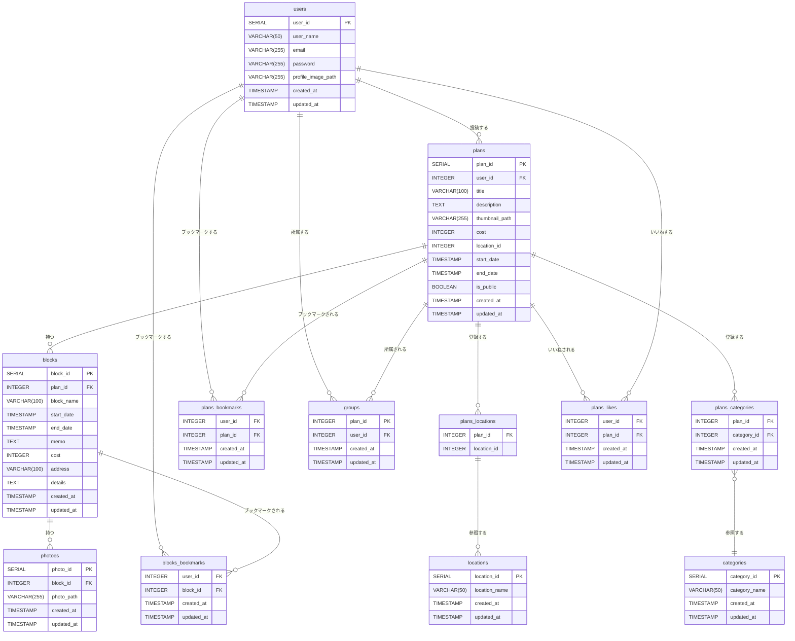

# manetabi_api

## リレーション

---

# **データ設計**

---

## user (ユーザ)

| カラム名           | 説明                     | 型           | Key     | Unique | Nullable |
| ------------------ | ------------------------ | ------------ | ------- | ------ | -------- |
| user_id            | ユーザ ID                | SERIAL       | PRIMARY | YES    | NO       |
| user_name          | ユーザー名               | VARCHAR(50)  |         | NO     | NO       |
| email              | メールアドレス           | VARCHAR(255) |         | NO     | NO       |
| password           | ハッシュ化したパスワード | VARCHAR(255) |         | NO     | NO       |
| profile_image_path | プロフィール画像パス     | VARCHAR(255) |         | NO     | YES      |
| created_at         | 作成した時間             | TIMESTAMP    |         | NO     | NO       |
| updated_at         | 更新した時間             | TIMESTAMP    |         | NO     | NO       |

## plans (プランと投稿したもの)

| カラム名       | 説明               | 型           | Default | Key     | Unique | Nullable |
| -------------- | ------------------ | ------------ | ------- | ------- | ------ | -------- |
| plan_id        | プラン ID          | SERIAL       |         | PRIMARY | YES    | NO       |
| user_id        | ユーザ ID          | INTEGER      |         | FOREIGN | NO     | NO       |
| title          | タイトル           | VARCHAR(100) |         |         | NO     | NO       |
| description    | 説明文             | TEXT         |         |         | NO     | YES      |
| thumbnail_path | サムネイル画像パス | VARCHAR(255) |         |         | NO     | YES      |
| cost           | 費用               | INTEGER      |         |         | NO     | YES      |
| location_id    | 場所 ID            | INTEGER      |         | FOREIGN | NO     | YES      |
| start_date     | 開始日時           | TIMESTAMP    |         |         | NO     | YES      |
| end_date       | 終了日時           | TIMESTAMP    |         |         | NO     | YES      |
| is_public      | 公開フラグ         | BOOLEAN      | FALSE   |         | NO     | NO       |
| created_at     | 作成した時間       | TIMESTAMP    |         |         | NO     | NO       |
| updated_at     | 更新した時間       | TIMESTAMP    |         |         | NO     | NO       |

## blocks (プランの中にあるブロック)

| カラム名   | 説明         | 型           | Key     | Unique | Nullable |
| ---------- | ------------ | ------------ | ------- | ------ | -------- |
| block_id   | ブロック ID  | SERIAL       | PRIMARY | YES    | NO       |
| plan_id    | プラン ID    | INTEGER      | FOREIGN | NO     | NO       |
| block_name | ブロック名   | VARCHAR(100) |         | NO     | NO       |
| start_date | 開始日時     | TIMESTAMP    |         | NO     | NO       |
| end_date   | 終了日時     | TIMESTAMP    |         | NO     | NO       |
| memo       | メモ         | TEXT         |         | NO     | YES      |
| cost       | 費用         | INTEGER      |         | NO     | YES      |
| address    | 住所         | VARCHAR(100) |         | NO     | YES      |
| details    | 詳細         | TEXT         |         | NO     | YES      |
| created_at | 作成した時間 | TIMESTAMP    |         | NO     | NO       |
| updated_at | 更新した時間 | TIMESTAMP    |         | NO     | NO       |

## photoes (ブロックの中にある写真)

| カラム名   | 説明         | 型           | Key     | Unique | Nullable |
| ---------- | ------------ | ------------ | ------- | ------ | -------- |
| photo_id   | 画像 ID      | SERIAL       | PRIMARY | YES    | NO       |
| block_id   | ブロック ID  | INTEGER      | FOREIGN | NO     | NO       |
| photo_path | 画像パス     | VARCHAR(255) |         | NO     | NO       |
| created_at | 作成した時間 | TIMESTAMP    |         | NO     | NO       |
| updated_at | 更新した時間 | TIMESTAMP    |         | NO     | NO       |

## locations (検索用の場所)

| カラム名      | 説明         | 型          | Key     | Unique | Nullable |
| ------------- | ------------ | ----------- | ------- | ------ | -------- |
| location_id   | 場所 ID      | SERIAL      | PRIMARY | YES    | NO       |
| location_name | 場所名       | VARCHAR(50) |         | NO     | NO       |
| created_at    | 作成した時間 | TIMESTAMP   |         | NO     | NO       |
| updated_at    | 更新した時間 | TIMESTAMP   |         | NO     | NO       |

## categories (検索用のカテゴリ)

| カラム名      | 説明         | 型          | Key     | Unique | Nullable |
| ------------- | ------------ | ----------- | ------- | ------ | -------- |
| category_id   | カテゴリ ID  | SERIAL      | PRIMARY | YES    | NO       |
| category_name | カテゴリ名   | VARCHAR(50) |         |        | NO       |
| created_at    | 作成した時間 | TIMESTAMP   |         | NO     | NO       |
| updated_at    | 更新した時間 | TIMESTAMP   |         | NO     | NO       |

## plans_bookmarks (プランのブックマーク)

| カラム名   | 説明         | 型        | Key     | Unique | Nullable |
| ---------- | ------------ | --------- | ------- | ------ | -------- |
| user_id    | ユーザ ID    | INTEGER   | FOREIGN | NO     | NO       |
| plan_id    | ブロック ID  | INTEGER   | FOREIGN | NO     | NO       |
| created_at | 作成した時間 | TIMESTAMP |         | NO     | NO       |
| updated_at | 更新した時間 | TIMESTAMP |         | NO     | NO       |

## blocks_bookmarks (ブロックのブックマーク)

| カラム名   | 説明         | 型        | Key     | Unique | Nullable |
| ---------- | ------------ | --------- | ------- | ------ | -------- |
| user_id    | ユーザ ID    | INTEGER   | FOREIGN | NO     | NO       |
| block_id   | ブロック ID  | INTEGER   | FOREIGN | NO     | NO       |
| created_at | 作成した時間 | TIMESTAMP |         | NO     | NO       |
| updated_at | 更新した時間 | TIMESTAMP |         | NO     | NO       |

## plans_likes (プランのいいね)

| カラム名   | 説明         | 型        | Key     | Unique | Nullable |
| ---------- | ------------ | --------- | ------- | ------ | -------- |
| user_id    | ユーザ ID    | INTEGER   | FOREIGN | NO     | NO       |
| plan_id    | 投稿 ID      | INTEGER   | FOREIGN | NO     | NO       |
| created_at | 作成した時間 | TIMESTAMP |         | NO     | NO       |
| updated_at | 更新した時間 | TIMESTAMP |         | NO     | NO       |

## plans_locations (プランと場所を紐づける)

| カラム名    | 説明         | 型        | Key     | Unique | Nullable |
| ----------- | ------------ | --------- | ------- | ------ | -------- |
| plan_id     | 投稿 ID      | INTEGER   | FOREIGN | NO     | NO       |
| location_id | 場所 ID      | INTEGER   | FOREIGN | NO     | NO       |
| created_at  | 作成した時間 | TIMESTAMP |         | NO     | NO       |
| updated_at  | 更新した時間 | TIMESTAMP |         | NO     | NO       |

## plans_categories (プランとカテゴリを紐づける)

| カラム名    | 説明         | 型        | Key     | Unique | Nullable |
| ----------- | ------------ | --------- | ------- | ------ | -------- |
| plan_id     | 投稿 ID      | INTEGER   | FOREIGN | NO     | NO       |
| category_id | カテゴリ ID  | INTEGER   | FOREIGN | NO     | NO       |
| created_at  | 作成した時間 | TIMESTAMP |         | NO     | NO       |
| updated_at  | 更新した時間 | TIMESTAMP |         | NO     | NO       |

## groups (ユーザとプランを紐づける)

| カラム名   | 説明         | 型        | Key     | Unique | Nullable |
| ---------- | ------------ | --------- | ------- | ------ | -------- |
| plan_id    | プラン ID    | INTEGER   | FOREIGN | NO     | NO       |
| user_id    | ユーザ ID    | INTEGER   | FOREIGN | NO     | NO       |
| created_at | 作成した時間 | TIMESTAMP |         | NO     | NO       |
| updated_at | 更新した時間 | TIMESTAMP |         | NO     | NO       |
